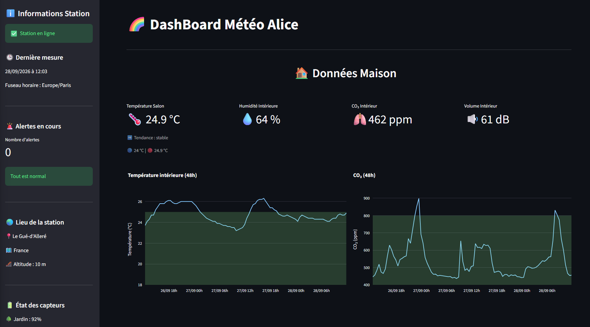

# Dashboard météo Netatmo

J'ai une station météo Netatmo à la maison, et j'avais envie de m'approprier ses données. Si vous connaissez, l'application officielle fait le job et elle est agréable à utiliser, mais je voulais mes propres indicateurs : des alertes adaptées à mon usage (aérer quand le CO₂ monte, risque de gel pour le jardin) et une vue d'ensemble sur une seule page.

**[Voir l'application en ligne](https://netatmo-dashboard-jegzlh8z6ext95f6zedecx.streamlit.app/)**



## Ce que fait l'app

Elle récupère les données de la station via l'API Netatmo et affiche :
- les mesures actuelles de l'intérieur, du jardin et du pluviomètre ;
- l'historique des 48 dernières heures, avec une zone de confort sur les graphiques intérieurs ;
- des alertes quand une valeur sort des seuils que j'ai fixés ;
- l'état de la station et des batteries.

Python, Streamlit, Pandas, Plotly. Hébergée sur Streamlit Community Cloud.

## Les problèmes que j'ai dû régler

La première version fonctionnait sur mon PC. La mettre en ligne m'a obligé à revoir pas mal de choses :

**Le token qui expire.** Le token d'accès Netatmo ne dure que 3 heures. Au départ, mon code réécrivait le nouveau token dans un fichier `.env`. Ça ne marche pas sur un serveur où les fichiers sont effacés à chaque redémarrage. Maintenant, l'app génère un token neuf au démarrage et le garde en cache pour les 3 heures suivantes.

**L'historique.** J'enregistrais les mesures dans un CSV à chaque ouverture de la page. Deux défauts : des trous dès que personne ne consultait l'app, et un fichier perdu à chaque redémarrage. En creusant la doc, j'ai découvert que Netatmo garde tout l'historique et le fournit via l'endpoint `getmeasure` : j'ai supprimé le CSV !

**Le crash de minuit.** Un soir, l'app a planté à 00h06 avec une `KeyError`. Netatmo remet les min/max du jour à zéro à minuit, et pendant quelques minutes, ces valeurs n'existent plus dans la réponse. Depuis, les données qui peuvent manquer temporairement ont une valeur de repli (et plus de panique d'avoir tout cassé juste après minuit).

**Le décalage horaire.** Le serveur tourne en heure UTC. Sans conversion explicite, l'heure de la dernière mesure s'affichait avec 2 heures de retard.

J'ai aussi regroupé les huit blocs de graphiques, quasiment identiques, dans une seule fonction, après avoir perdu du temps sur un graphique qui en affichait un autre à cause d'une erreur d'indentation.

## Lancer le projet en local

```bash
git clone https://github.com/cycarius17/netatmo-dashboard.git
cd netatmo-dashboard
python -m venv venv
```

Activer le venv (`.\venv\Scripts\Activate.ps1` sous Windows, `source venv/bin/activate` sous macOS/Linux), puis :

```bash
pip install -r requirements.txt
```

Il faut une application créée sur [dev.netatmo.com](https://dev.netatmo.com) (scope `read_station`), et un fichier `.streamlit/secrets.toml` :

```toml
NETATMO_CLIENT_ID = "..."
NETATMO_CLIENT_SECRET = "..."
NETATMO_REFRESH_TOKEN = "..."
```

Puis `streamlit run app.py`.

## Pour la suite

J'aimerais ajouter une carte de chaleur jour × heure sur une semaine, pour voir les habitudes de la maison : à quelle heure le CO₂ monte, quand le salon refroidit. Et ajouter un anémomètre pour avoir un peu plus de données !
